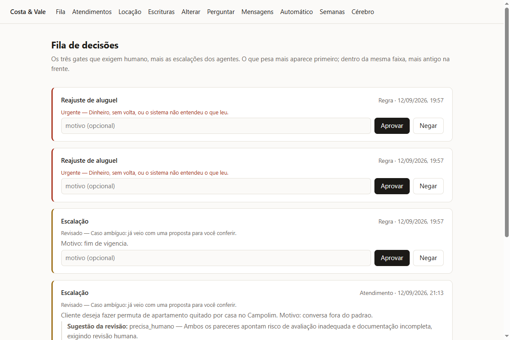
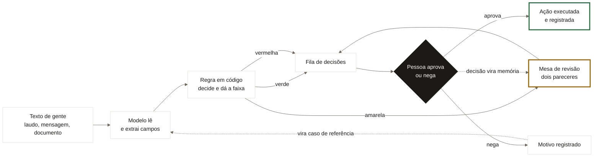
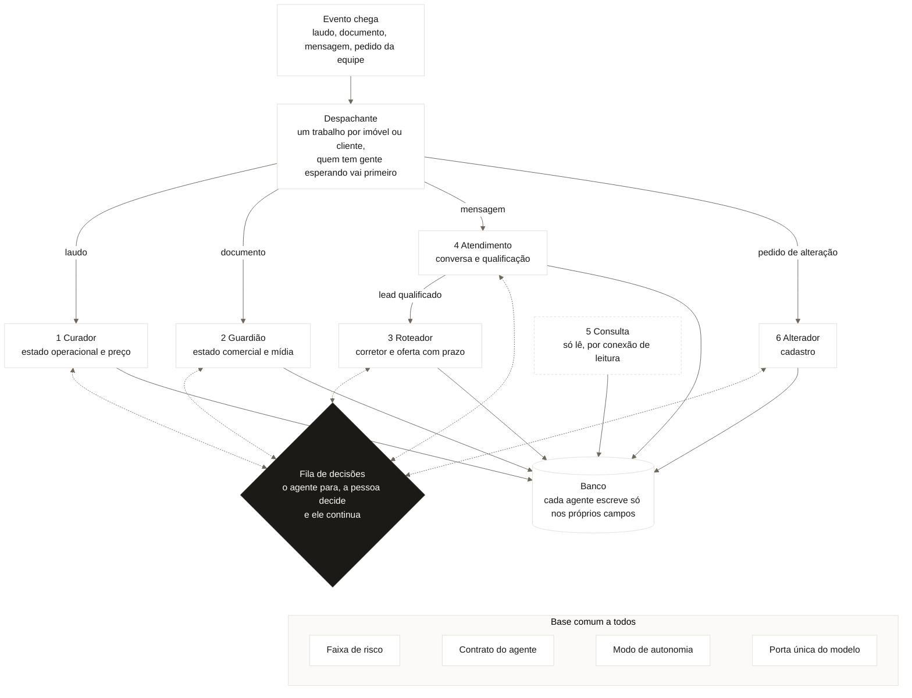
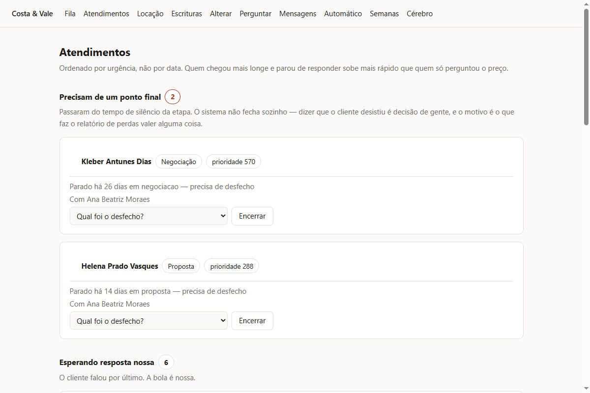
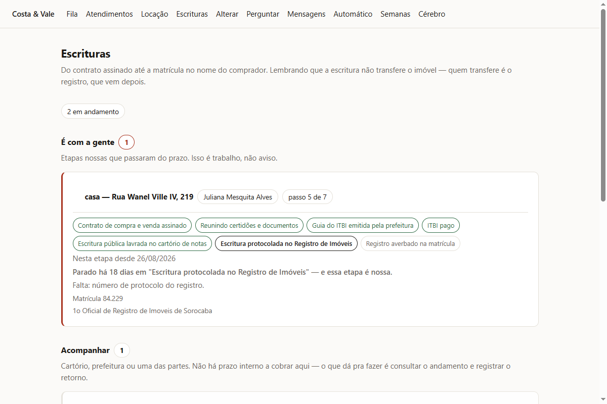

# Costa & Vale Imóveis

Sistema de estoque, anúncio e atendimento para uma imobiliária, conduzido por
**seis agentes de IA sobre um núcleo de regras determinísticas**.

A ideia que organiza tudo: **o modelo lê texto de gente, e as decisões ficam com
as regras.** Ele extrai o que um vendedor escreveu num laudo de vistoria, e uma
função em TypeScript decide se o imóvel pode ser anunciado. Essa função é
testável sem chave de API e sem banco. Um erro do modelo vira um dado errado
que alguém consegue ver e corrigir antes de qualquer ação.

> Sistema funcional e pronto para rodar, com dados de demonstração de uma
> imobiliária de Sorocaba. Ainda não está em produção.

## O problema

Uma imobiliária pequena perde dinheiro em lugares que ninguém vê: o imóvel que
ficou pronto e nunca foi anunciado, a campanha paga que continua rodando num
imóvel já vendido, o lead que chegou às 22h de domingo e foi respondido na
terça, o cliente que fez proposta e sumiu sem ninguém registrar por quê.

Todos esses problemas são de **coordenação**, e é isso que o sistema faz.

## O caminho de um pedido

## Os seis agentes

| # | Agente | O que faz | Chama modelo? |
|---|---|---|---|
| 1 | **Curador** | Lê o laudo de vistoria, decide o estado do imóvel por regra e pede aprovação para publicar | sim, só na extração |
| 2 | **Guardião** | Lê documentos da negociação e protege o estoque quando um imóvel sai do mercado | sim, só na extração |
| 3 | **Roteador** | Escolhe o corretor e oferece o lead com prazo | **não**, é determinístico |
| 4 | **Atendimento** | Responde 24/7, qualifica e entrega ao Roteador | sim |
| 5 | **Consulta** | Responde perguntas da equipe sobre 6 relatórios | sim, e o número vem do banco |
| 6 | **Alterador** | Traduz "muda o preço do apartamento do Campolim" em alteração de cadastro | sim |

Repare no 3: **o agente mais autônomo é o único sem IA.** Tipo de agente e
nível de autonomia são eixos independentes. O Guardião é o mais sofisticado e o
que mais precisa de gente; o Roteador é quase um gatilho e o que age mais
sozinho.

### Como os agentes trabalham juntos

- **Quem começa é o evento.** Cada tipo de evento tem um único agente dono, e o despachante garante que dois trabalhos no mesmo imóvel ou cliente não rodem ao mesmo tempo.
- **A única passagem direta é do Atendimento para o Roteador**, quando o lead fica qualificado. Uma escalação sai para a fila de decisões.
- **Os outros se coordenam pelo banco.** O Curador cuida do estado operacional, o Guardião do comercial, o Alterador do cadastro, e o contrato impede que um escreva no campo do outro.
- **Quando precisa de gente, o agente para.** O pedido vai para a fila, e a decisão volta para o mesmo agente, que continua de onde parou.
- **Diagramas UML** (entidades, estados e sequência do lead) em [`docs/UML.md`](docs/UML.md).
- **Regras próprias de cada um:** Curador decide o estado do imóvel no próprio arquivo; Guardião usa `publicacao.ts`; Roteador, `roteamento.ts`; Atendimento, `match.ts`; Alterador, `alteracao.ts`.

## Como o sistema trabalha

**Cada agente só escreve nos próprios campos.** Cada um recebe um contexto
tipado com os campos que possui, e escrever no campo de outro falha na
compilação.

**O nó que interrompe não age.** O `interrupt()` do LangGraph re-executa o nó do
começo quando a execução é retomada, então qualquer efeito colateral antes dele
aconteceria duas vezes: modelo cobrado em dobro, pedido virando duas linhas na
fila. Por isso o nó do agente e o nó que interrompe são separados, com
memoização no estado e índices únicos no banco. O teste está em
`src/grafo/r7.test.ts`.

**Atendimento a qualquer hora, corretor no horário dele.** Um lead que chega às
3h da manhã é respondido na hora, e a oferta ao corretor espera as 7h30. Assim o
rodízio de 5 minutos não gasta os três melhores corretores enquanto dormem, nem
os registra como quem não respondeu.

**Identidade entre canais só funde com confirmação.** A mesma pessoa chega pelo
Instagram como `@ju.mendes.sp` e pelo WhatsApp como "Ju Mendes", sem nenhum
campo em comum. O sistema reconhece pelo miolo do apelido e transforma o palpite
numa pergunta no painel. **Duplicar é chato; fundir errado mostra a negociação
de um cliente para outro.**

**O cérebro guarda o que a equipe entendeu.** As observações vivem num schema
Postgres separado, entram no prompt marcadas como observação e perdem de
qualquer dado do cadastro. O pior que uma nota errada faz é o agente responder
pior, e nenhuma nota altera um contrato. Corrigir escreve embaixo, com data e
autor, como averbação de matrícula.

**Mensagem fora do assunto recebe resposta fixa e fica fora do funil.** Número
errado, spam e pergunta de outro ramo recebem um texto escrito em código, e nada
é gravado. Assim a fila ordenada por urgência continua com gente que quer
comprar. A proposta atípica (permuta, litígio) escala, porque **calar um cliente
de verdade custa mais que responder a um engano**.

**Atendimento só fecha com uma pessoa.** Passado o tempo de silêncio, o caso
sobe ao topo da fila pedindo um desfecho. Fechar sozinho seria escrever "não
quis" quando a verdade é "não sei".

**Cada etapa da escritura sabe de quem é a vez.** O que depende da imobiliária
vira tarefa com prazo; o que depende de cartório ou prefeitura vira
acompanhamento. Assim o alerta só aparece quando a equipe pode agir.

**Risco em faixas, todas com aprovação.** Cada pedido sai verde, amarelo ou
vermelho. A faixa ordena a fila e escolhe o canal de aviso, e o verde também
espera alguém. O amarelo passa antes por uma mesa de revisão: dois papéis em
tensão (CrewAI, num serviço Python à parte) leem o caso, e se divergirem uma
regra de código sobe o caso para uma pessoa. A mesa não tem acesso ao banco.

**A mesa lembra o que a pessoa decidiu.** Aprovação ou recusa no painel vai para
a memória da mesa com o motivo, marcada `[gente]` e com peso maior que o palpite
da própria mesa. No próximo caso parecido, a decisão humana volta no contexto.

**Toda escrita declara quanta autonomia tem.** `src/regras/modo.ts` diz, campo
por campo, se o sistema para e espera (hitl), age e alguém confere (hotl) ou
age sem revisão (hootl), com o porquê. Campo novo sem declaração quebra a
suíte. O que rodou sem aprovação aparece em `/automatico`.

## As telas

| Rota | O que é |
|---|---|
| `/` | Fila de decisões humanas e ofertas de lead em aberto |
| `/funil` | Atendimentos ordenados por urgência |
| `/locacao` | Contratos, parcelas, atrasos e reajustes devidos |
| `/escrituras` | A esteira até a matrícula, separada por de quem é a vez |
| `/alterar` | Pedido de alteração de cadastro em texto livre |
| `/consulta` | Perguntas da equipe sobre os relatórios |
| `/mensagens` | Tudo que o sistema falou, ou teria falado com o canal desligado |
| `/automatico` | O que o sistema fez sem ninguém aprovar |
| `/semanas` | As últimas 12 semanas: leads, decisões, expirados, tempo até decidir, falhas do modelo |
| `/cerebro` | O que a equipe entendeu com a operação, editável e sem acesso ao cadastro |
| `/imovel/[id]` | "Por que esse anúncio caiu?": o histórico completo |

**Atendimentos** ordenados pelo que precisa de alguém primeiro:

**Escrituras** separando o que é da imobiliária do que depende de cartório:

## Segurança

- **Painel com senha**, guardada só como hash com sal por pessoa. Sem usuários
  configurados, o painel recusa tudo.
- **Quem decidiu é quem entrou.** A trilha de auditoria assina com a sessão.
- **Dados pessoais cifrados** (CPF, telefone, e-mail, identificadores de canal).
  Um dump do banco sozinho não revela ninguém.
- **Row Level Security** em todas as tabelas, e o agente que responde perguntas
  usa uma conexão só de leitura, sem acesso à trilha de auditoria.
- **Conexão com o banco autenticada** e cifrada.
- **Rotas de integração protegidas por segredo**, comparado em tempo constante.
- **Nenhum segredo no navegador**: sem cookies, sem tokens no `localStorage`,
  sem variável pública, com teste impedindo a regressão.
- **Avisos com lista de permissão**: fala, nome e telefone do cliente ficam no
  painel e nunca vão por WhatsApp ou e-mail.

Os detalhes técnicos estão em [`docs/SEGURANCA.md`](docs/SEGURANCA.md).

## Stack

LangGraph.js · LangChain · Groq · Next.js (App Router) · Drizzle ORM ·
PostgreSQL · Vitest · TypeScript · Zod

Mesa de revisão: Python · FastAPI · CrewAI · Pydantic · LanceDB · pytest. O
contrato entre Zod e Pydantic é conferido por teste nos dois lados.

## Limites conhecidos

- Nenhum canal está ligado: as mensagens ficam registradas em `/mensagens` com
  o texto exato e saem quando `WHATSAPP_BRIDGE_URL` existir.
- **Ajuste do modelo sempre passa por uma pessoa.** O sistema registra qual
  modelo e qual versão de prompt produziram cada leitura, afere contra casos de
  referência (`npm run aferir`) e transforma leitura negada no painel em
  candidata a caso novo (`npm run propor-casos`). O plano está em
  `docs/PLANO_CEREBRO.md`.
- O Groq gratuito tem limite de tokens por minuto. O sistema espera o que o
  Groq pede quando é até 15 segundos; acima disso a leitura falha e fica
  registrada.
- Os números de calibração (`docs/calibracao.json`) são chutes iniciais que
  precisam de operação real para afinar.
