# UML completo

Tudo do sistema num lugar só. Os diagramas separados continuam em
[`UML.md`](UML.md). Fontes: `src/lib/db/schema.ts`, `src/cerebro/schema.ts`,
`src/grafo/index.ts`, `src/agentes/`, `src/consulta/`, `src/mesa/`.

## 1. Componentes

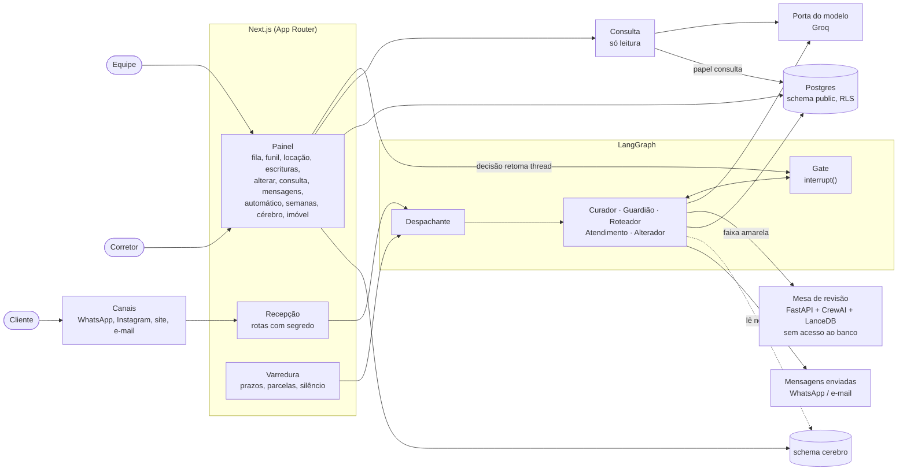

## 2. Entidades (todas as tabelas)

```mermaid
erDiagram
  CLIENTE ||--o{ PAPEL : exerce
  IMOVEL |o--o{ PAPEL : "papel sobre"
  CLIENTE |o--o{ IMOVEL : "é proprietário"
  CORRETOR |o--o{ IMOVEL : captou
  IMOVEL ||--o{ ANUNCIO : "publicado em"
  IMOVEL ||--o{ LAUDO : "vistoriado por"
  CLIENTE ||--o{ BUSCA : procura
  CLIENTE ||--o{ IDENTIDADE : "chega por"
  CORRETOR ||--o{ DOMINIO_CORRETOR : conhece
  IMOVEL ||--o{ DOMINIO_CORRETOR : "conhecido por"
  CLIENTE ||--o{ VINCULO_LEAD_CORRETOR : "atendido por"
  CORRETOR ||--o{ VINCULO_LEAD_CORRETOR : atende
  CORRETOR ||--o{ AGENDA : agenda
  IMOVEL |o--o{ AGENDA : visita
  CLIENTE |o--o{ AGENDA : visita
  CLIENTE ||--o{ ATENDIMENTO : conversa
  IMOVEL |o--o{ ATENDIMENTO : sobre
  CORRETOR |o--o{ ATENDIMENTO : conduz
  IMOVEL ||--o{ TRANSACAO : negociado
  CLIENTE |o--o{ TRANSACAO : compra
  CORRETOR |o--o{ TRANSACAO : fecha
  IMOVEL ||--o{ CONTRATO_LOCACAO : alugado
  CLIENTE ||--o{ CONTRATO_LOCACAO : "inquilino e proprietário"
  CONTRATO_LOCACAO ||--o{ PARCELA_ALUGUEL : gera
  IMOVEL ||--o{ PROCESSO_ESCRITURA : escriturado
  TRANSACAO |o--o{ PROCESSO_ESCRITURA : formaliza
  CLIENTE |o--o{ PROCESSO_ESCRITURA : "comprador e vendedor"
  APROVACAO }o..|| ENTIDADE_QUALQUER : "entidade + id_entidade"
  LOG_EVENTO }o..|| ENTIDADE_QUALQUER : "entidade + id_entidade"
  APROVACAO }o..o| EVENTO_PROCESSADO : id_evento
  LOG_EVENTO }o..o| EVENTO_PROCESSADO : id_evento
  LEITURA_MODELO }o..o| EVENTO_PROCESSADO : id_evento
  NOTA |o..o| NOTA : substitui

  IMOVEL {
    uuid id_imovel PK
    varchar tipo
    numeric preco
    text endereco
    varchar bairro
    varchar cidade
    uuid id_proprietario FK
    uuid id_corretor_captador FK
    enum estado_operacional
    enum estado_comercial
    enum estado_anuncio
    timestamp data_captacao
  }
  ANUNCIO {
    uuid id_anuncio PK
    uuid id_imovel FK
    varchar canal
    enum status
    boolean midia_paga
    numeric custo_acumulado
  }
  LAUDO {
    uuid id_laudo PK
    uuid id_imovel FK
    text texto_estado
    text texto_documentacao
    text texto_pendencias
    jsonb extracao_estruturada
  }
  CLIENTE {
    uuid id_cliente PK
    varchar nome
    text cpf_cnpj "cifrado"
    text telefone "cifrado"
    text email "cifrado"
    varchar email_indice "HMAC"
    varchar origem_canal
  }
  PAPEL {
    uuid id_papel PK
    uuid id_cliente FK
    uuid id_imovel FK
    enum papel
    boolean ativo
  }
  BUSCA {
    uuid id_busca PK
    uuid id_cliente FK
    numeric valor_min
    numeric valor_max
    varchar tipo_imovel
    text_array bairros_desejados
    text texto_original
  }
  IDENTIDADE {
    uuid id PK
    uuid id_cliente FK
    enum canal
    text identificador "cifrado"
    varchar identificador_indice UK
    varchar apelido
    enum origem
  }
  CORRETOR {
    uuid id_corretor PK
    varchar nome
    text telefone "cifrado"
    numeric comissao_percentual
    text_array regioes_atuacao
    boolean ativo
  }
  DOMINIO_CORRETOR {
    uuid id PK
    uuid id_corretor FK
    uuid id_imovel FK
    enum nivel
  }
  VINCULO_LEAD_CORRETOR {
    uuid id PK
    uuid id_cliente FK
    uuid id_corretor FK
    timestamp ultima_interacao
    boolean ativo
  }
  AGENDA {
    uuid id_evento PK
    uuid id_corretor FK
    timestamp inicio
    timestamp fim
    varchar status
  }
  ATENDIMENTO {
    uuid id_atendimento PK
    uuid id_cliente FK
    uuid id_imovel FK
    uuid id_corretor FK
    enum etapa
    enum etapa_maxima
    enum estado
    text motivo_desfecho
    int prioridade
    boolean precisa_desfecho
  }
  TRANSACAO {
    uuid id_transacao PK
    uuid id_imovel FK
    varchar tipo
    numeric valor_final
    varchar etapa
    boolean comissao_paga
  }
  CONTRATO_LOCACAO {
    uuid id_contrato PK
    uuid id_imovel FK
    uuid id_inquilino FK
    uuid id_proprietario FK
    numeric valor_aluguel
    int dia_vencimento
    enum indice
    numeric taxa_administracao
    enum estado
  }
  PARCELA_ALUGUEL {
    uuid id_parcela PK
    uuid id_contrato FK
    varchar competencia
    numeric valor_base
    numeric valor_encargos
    enum estado
    int estagio_cobranca
  }
  PROCESSO_ESCRITURA {
    uuid id_processo PK
    uuid id_imovel FK
    uuid id_transacao FK
    enum etapa
    timestamp etapa_desde
    varchar matricula
    numeric valor_itbi
  }
  APROVACAO {
    uuid id PK
    enum tipo
    enum estado
    enum faixa
    enum solicitado_por_agente
    varchar thread_id
    timestamp expira_em
    jsonb proposta
    varchar decidido_por
  }
  LOG_EVENTO {
    uuid id PK
    enum agente_origem
    varchar campo
    text valor_anterior
    text valor_novo
    varchar aprovado_por
  }
  EVENTO_PROCESSADO {
    uuid id_evento PK
    varchar tipo
    enum agente
  }
  LEITURA_MODELO {
    uuid id PK
    varchar agente
    varchar modelo
    varchar prompt_hash
    jsonb saida
    text erro
  }
  MENSAGEM_ENVIADA {
    uuid id PK
    varchar canal
    varchar destino
    text texto
    varchar estado
  }
  NOTA {
    uuid id PK "schema cerebro"
    varchar escopo
    varchar chave
    text texto
    enum estado
    uuid substitui
  }
```

## 3. Agentes (classes)

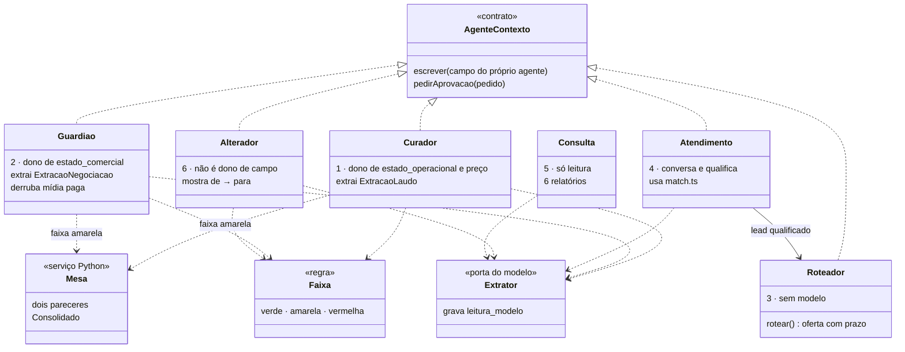

## 4. Estados

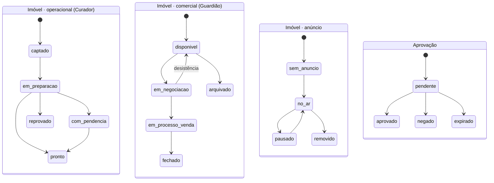

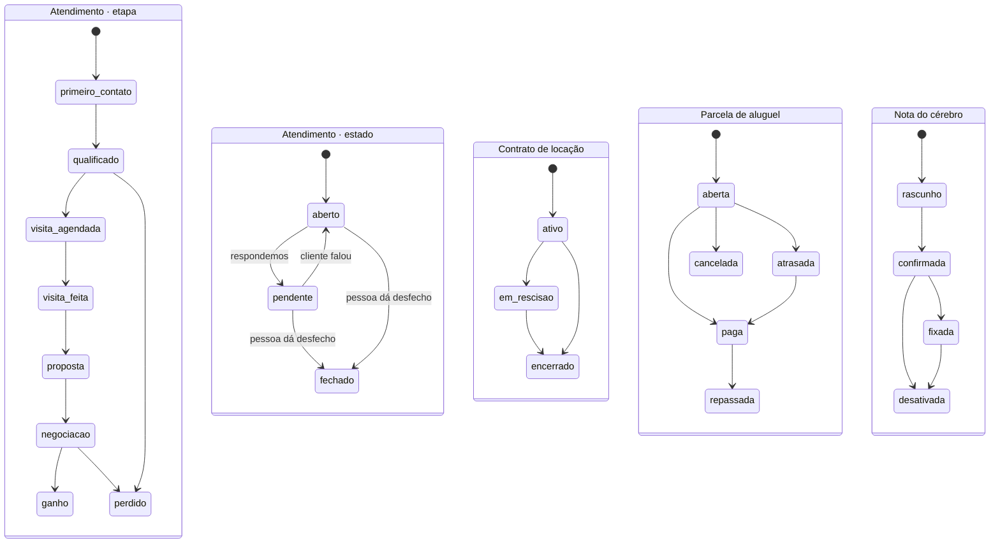

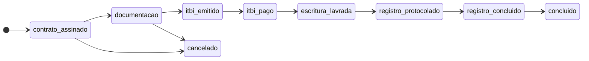

## 5. Sequências

### Curador: laudo até anúncio

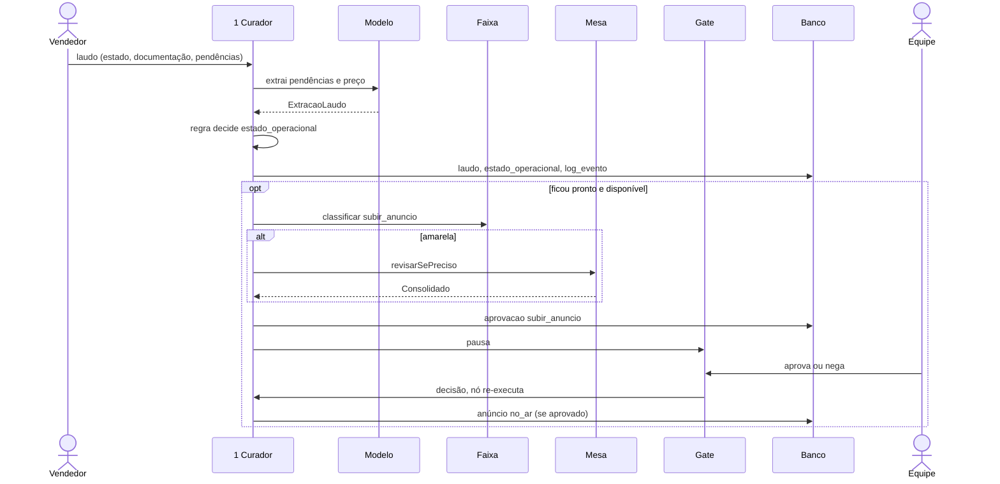

### Guardião: documento até derrubar mídia

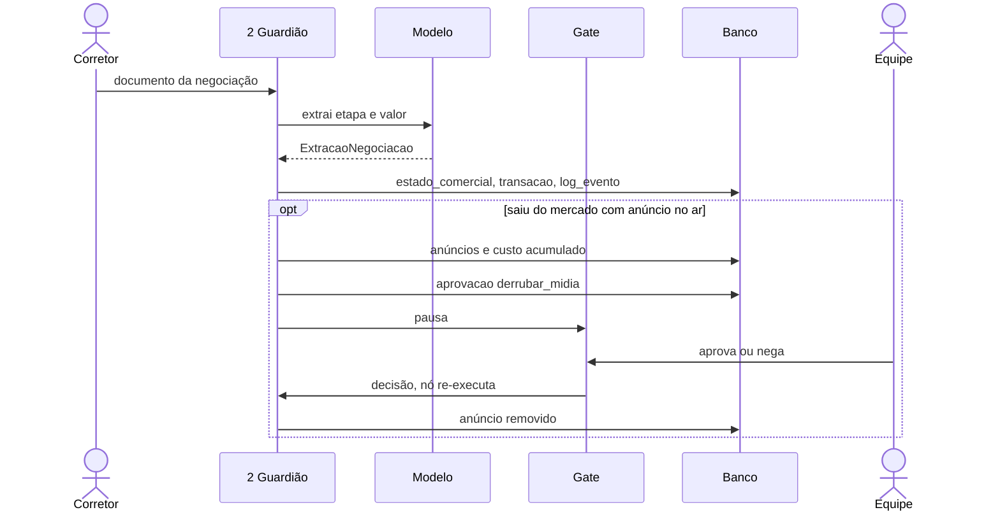

### Atendimento e Roteador: lead até corretor

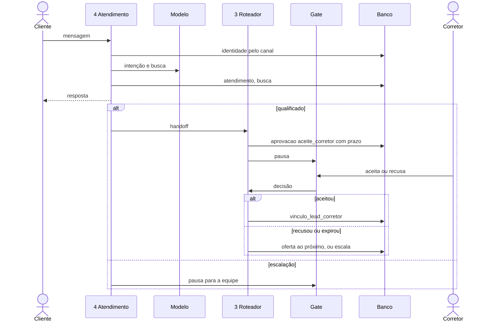

### Alterador: texto livre até cadastro

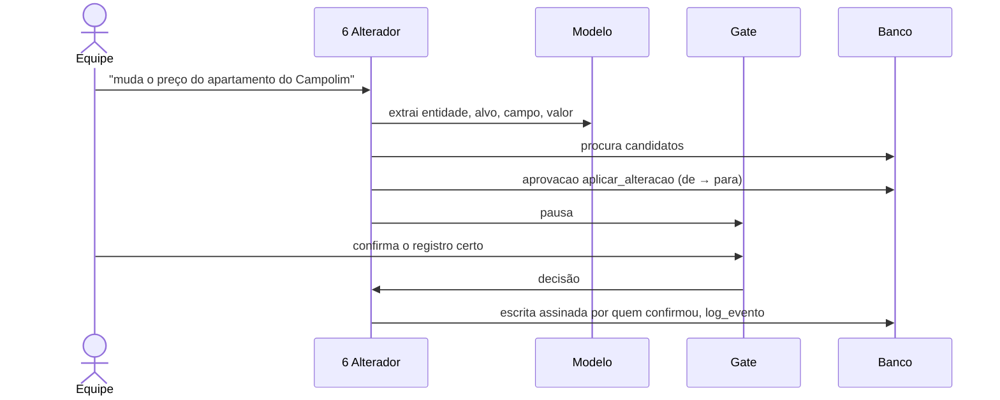

### Consulta: pergunta da equipe

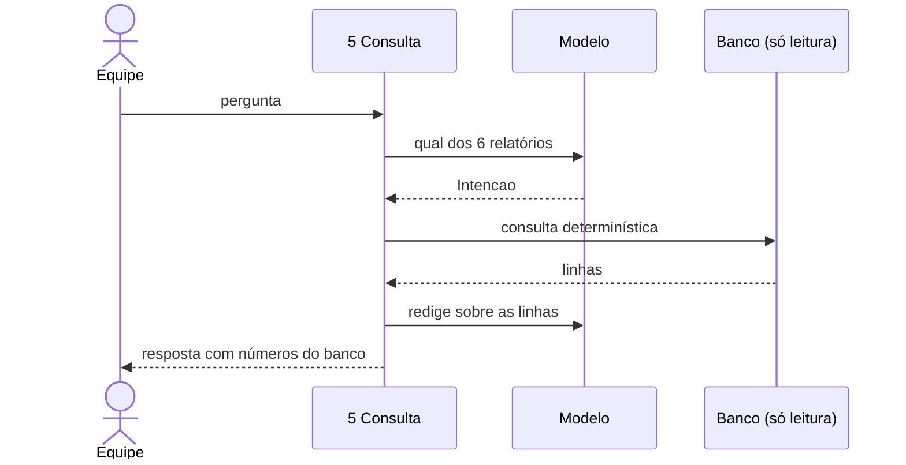
