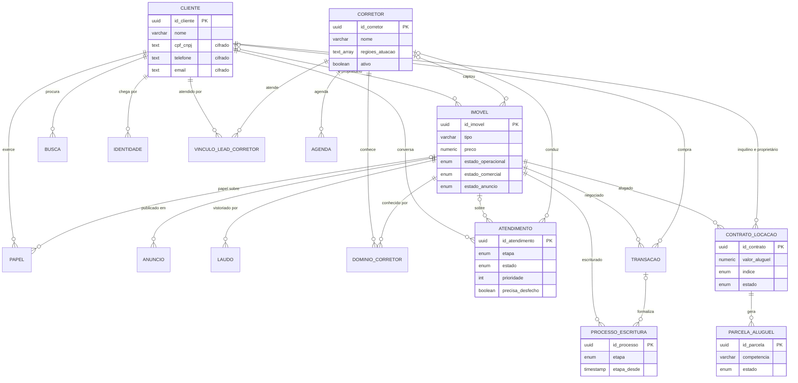
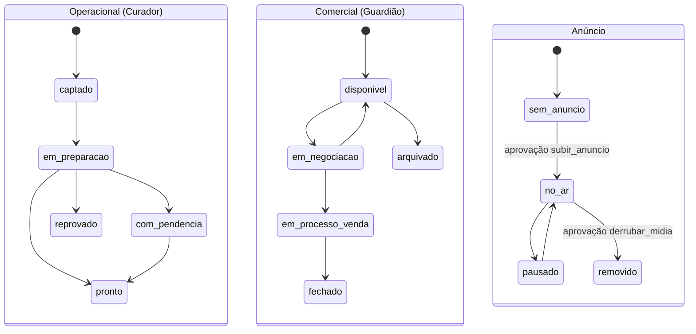
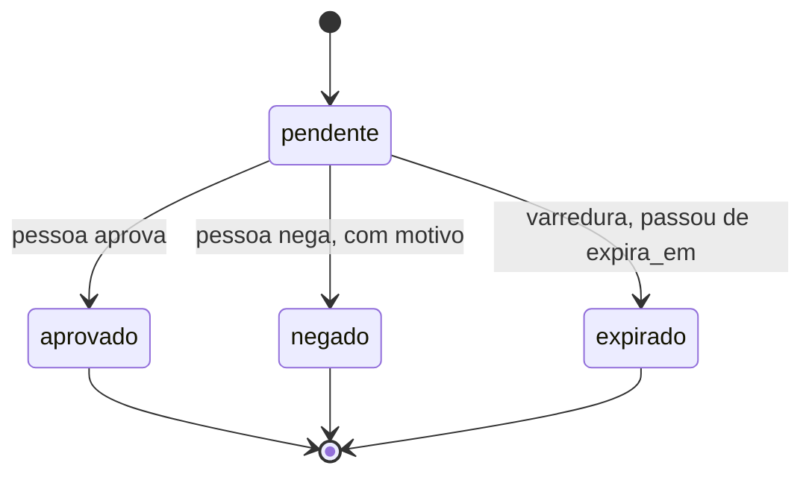
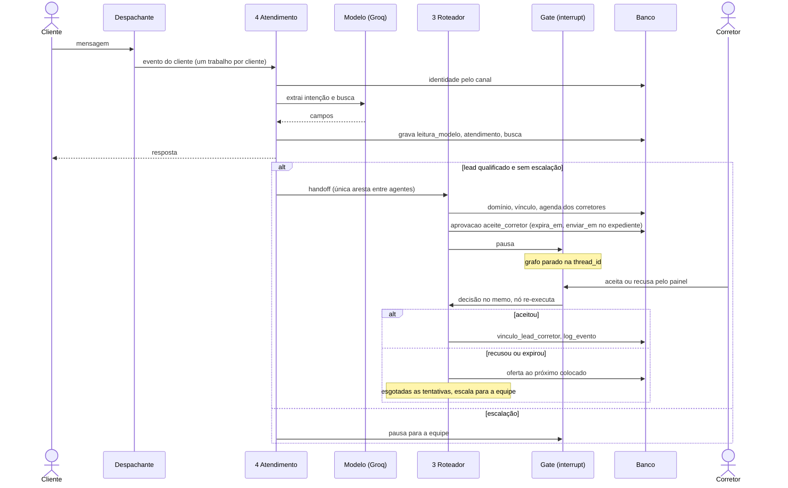

# UML

Diagramas tirados do código: `src/lib/db/schema.ts`, `src/cerebro/schema.ts` e
`src/grafo/index.ts`. Mudou o schema ou o grafo, atualize aqui.

## Entidades e relacionamentos

Tabelas sem chave estrangeira, ligadas por `entidade` + `id_entidade` ou por
`id_evento`: `aprovacao` (fila de decisões), `log_evento` (trilha de auditoria),
`evento_processado` (idempotência), `leitura_modelo` (procedência),
`mensagem_enviada`. O schema `cerebro.nota` fica fora de propósito, sem nenhuma
chave para o cadastro.

## Estados do imóvel

Três máquinas independentes, cada uma com um dono. O banco recusa anúncio
`no_ar` sem `pronto` e `disponivel` (check `anuncio_exige_pronto_e_disponivel`).

## Estados da aprovação

## Sequência: lead do WhatsApp até o corretor

